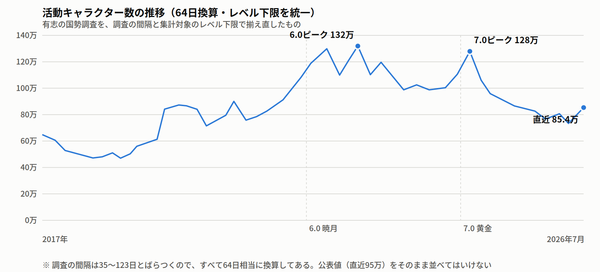
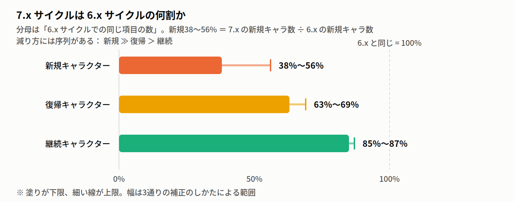
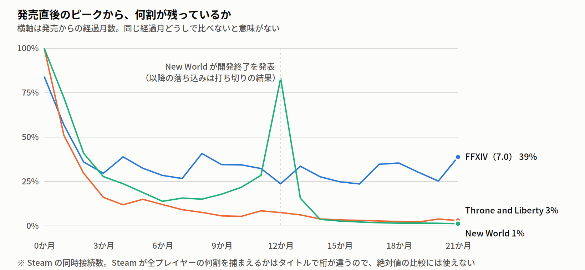
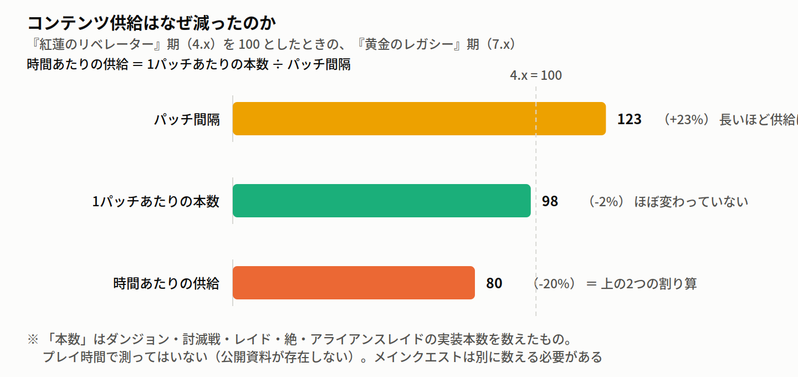

# Final Fantasy XIV 事業・経済状況から見た将来予測

> 📜 FFXIV をいつまで遊び続けられるのか。3年後を予想する。
> 📅 **作成日**: 2026年8月30日 ｜ ⏳ **対象期間**: 2026年下期 〜 2029年12月 ｜ 🧭 **対象パッチ**: 7.3 〜 8.x期  
> ⚠️ **Note**: この予測をするために立てた14個の問いのうち、はっきり答えられたのは8つ。残り6つは「推定できない」。それも隠さず書いている。予測というのは、当たる部分と当たらない部分を分けて示すものだから。

---

## 🧭 目次 (Table of Contents)

- [0. 要約](#0-要約)
  - [0-1. いつまで遊べるか — 先に結論](#0-1-いつまで遊べるか--先に結論)
  - [0-2. 数字で言うと](#0-2-数字で言うと)
  - [0-3. すでに起きたこと、これから起きること](#0-3-すでに起きたことこれから起きること)
    - [物語が完結したのに、なぜ急に人がいなくなっていないのか](#物語が完結したのになぜ急に人がいなくなっていないのか)
  - [0-4. 何が減っているのか — ここが一番大事](#0-4-何が減っているのか--ここが一番大事)
  - [0-5. 正直に言うと、わからないこと](#0-5-正直に言うとわからないこと)
- [1. MMOビジネスを取り巻く状況](#1-mmoビジネスを取り巻く状況)
  - [1-1. 日本](#1-1-日本)
    - [日本で FFXIV から客を奪えた競合は、見当たらない](#日本で-ffxiv-から客を奪えた競合は見当たらない)
    - [日本の料金は13年間据え置き、実質は値下がりしている](#日本の料金は13年間据え置き実質は値下がりしている)
    - [Switch 2版（2026年8月4日開始）](#switch-2版2026年8月4日開始)
  - [1-2. グローバル](#1-2-グローバル)
    - [MMO はどういうきっかけで終わるのかを調べた](#mmo-はどういうきっかけで終わるのかを調べた)
    - [課金モデルが変わる可能性](#課金モデルが変わる可能性)
    - [「不評な拡張のあと回復した」相場（ベースレート）は取得できなかった](#不評な拡張のあと回復した相場ベースレートは取得できなかった)
    - [なぜ新作 MMO は立ち上がらないのか](#なぜ新作-mmo-は立ち上がらないのか)
  - [1-3. まとめ — FFXIV が置かれている位置](#1-3-まとめ--ffxiv-が置かれている位置)
- [2. FFXIVビジネスの状況（2026年8月時点）](#2-ffxivビジネスの状況2026年8月時点)
  - [2-1. 人はどれだけ減ったか](#2-1-人はどれだけ減ったか)
  - [2-2. 売上はどれだけ減ったか](#2-2-売上はどれだけ減ったか)
  - [2-3. 日本はどれくらいを占めているか](#2-3-日本はどれくらいを占めているか)
  - [2-4. データセンターごとに差はあるか](#2-4-データセンターごとに差はあるか)
  - [2-5. 運営体制のリスク](#2-5-運営体制のリスク)
    - [CS3 が FFXVI を作った経験から何が言えるか](#cs3-が-ffxvi-を作った経験から何が言えるか)
  - [2-6. コンテンツはどれだけ供給されているか](#2-6-コンテンツはどれだけ供給されているか)
    - [何を見ればいいか](#何を見ればいいか)
- [3. FFXIV 3年後はどうなるか](#3-ffxiv-3年後はどうなるか)
  - [3-1. 主要イベント](#3-1-主要イベント)
  - [3-2. 考えられるシナリオ](#3-2-考えられるシナリオ)
    - [この利益がプレイヤーにとって何を意味するか](#この利益がプレイヤーにとって何を意味するか)
    - [何が起きたら予測を取り下げるか](#何が起きたら予測を取り下げるか)
- [4. リサーチクエスチョンとその回答の一覧](#4-リサーチクエスチョンとその回答の一覧)
- [5. すでにネット上にある議論との関係](#5-すでにネット上にある議論との関係)
- [6. この分析の限界](#6-この分析の限界)
  - [6-1. データそのものの限界](#6-1-データそのものの限界)
  - [6-2. 分析の限界](#6-2-分析の限界)
  - [6-3. 分析プロセスそのものの限界](#6-3-分析プロセスそのものの限界)
- [7. 参考文献](#7-参考文献)
  - [7-1. 一次データ](#7-1-一次データ)
  - [7-2. 公式発表・報道](#7-2-公式発表報道)
  - [7-3. 新規参入 MMO・サービス終了事例の調査で参照したもの](#7-3-新規参入-mmoサービス終了事例の調査で参照したもの)
  - [7-4. 数字の扱いについて](#7-4-数字の扱いについて)

---

## 0. 要約

### 0-1. いつまで遊べるか — 先に結論

> **3年後（2029年）、今と同じようにFFXIVを遊べる。** サービスが終わるシナリオは、この分析の結果からは見当たらない。
>
> **ただし「今と同じ規模」ではない。** 人は**今の水準から1割弱**減り、**コンテンツが出てくるペースは今の水準のまま**である。
>
> **そして重要なのは「これから人気が落ちる」のではなく「もう人気が落ちた」ということである。** 人が減る動きの大半はすでに起きてしまっていて、今は高水準を維持している。

**見るべき数字は3つ**

| 気になること | この分析の答え | 何を見れば分かるか |
|---|---|---|
| **サービスが終わるか** | **3年以内はまず無い。** 権利・開発・運営・課金がすべてスクウェア・エニックス社内にあり、外部に移す・ライセンスが切れる・技術的に維持できない、のいずれにも当てはまらない。スクウェア・エニックス社は MMO を「守る事業」と位置づけている。 | 決算での MMO 部門の扱い、次期中期経営計画（2027年5月ごろ） |
| **一緒に遊ぶ人がいなくなるか** | **いなくならない。** 3年後の中心予測は**今（85.4万）に対して −8%**。ただし**悲観シナリオ（確率25%）では −32% まで落ちる。** そして**新しく始める人は増えない。** | 有志の国勢調査（年3〜4回） |
| **コンテンツが減るか** | **すでに減っている。** 時間あたりの供給は『紅蓮のリベレーター』期の **8割**。ただし**1パッチの中身は薄くなっておらず、間隔が伸びた分だけ減っている。** | **パッチの間隔**。これが最も早く、最もはっきり見える。 |

> **この3つのうち、最も注意して見るべきなのは3つ目である。** 事業が傾くとき、決算の数字より先に「作るものが減る」ほうが表に出る（§1-2）。

### 0-2. 数字で言うと

鍵となる数字は3つ。

- **活動キャラクター数** … 有志が Lodestone（公式のキャラクター情報サイト）を巡回して数えている「一定期間に動いた形跡のあるキャラクター」の数。**アカウント数でも課金者数でもない。** サブキャラを持っている人は複数回数えられる。
- **拡張サイクル（8.x など）** … 拡張パッケージが出てから次が出るまでの約2年半。発売直後は人が多く、終盤は少ない。**この山谷が大きいので、時点どうしではなく「サイクル全体の平均」どうしを比べる。**（拡張直後の数字と拡張末期の数字を比べても、増減の意味が読めないため）
- **恒常為替（こうじょうかわせ）** … 為替レートを固定して計算し直した売上。現在の円安だと海外の売上が円建てで自動的に膨らむので、それを取り除いて「本当に売れているのか」を見るための計算。

そのうえで:

| | 7.x（黄金のレガシー期）の実績 | **8.x（次の拡張期）の予測** |
|---|---|---|
| **活動キャラクター数**（サイクル平均） | 90.6万 | **78.6万**（**幅 71.4万〜83.8万**） |
| MMO 部門の売上（恒常為替。**FFXIV ＋ ドラゴンクエストX ＋ FFXI の合算**。FFXIV 単体は非公表） | — | **FY2030.3 で 353億円** |
| MMO 部門の営業利益（＝**次のパッチと運営を作るための原資**） | — | **124〜151億円** |

活動キャラクター数の変化を率で言うと、**7.x のサイクル平均に対して −7% 〜 −21%、中心 −13%。**（直近の 85.4万 との比較なら中心 **−8%**）

> **なぜ点ではなく幅で書くのか。** この予測が乗っている数字は、**どれも1〜3回しか測れていないか、そもそも主観で置いたものである。** 内訳:
>
> | 何を振ったか | 主指標が動く幅 | 動く範囲 |
> |---|---|---|
> | **シナリオの確率**（25/50/25 は主観で置いた値） | **13.8pt** | −21% 〜 −7% |
> | **定着率と流入の同時変動**（この2つは別々に動かせない） | **8.7pt** | −19% 〜 −10% |
> | **8.0 のあと流入がどう変わるか**（設計上の選択） | **7.5pt** | −17% 〜 −10% |
> | ローンチでどれだけ跳ねるか（観測3回、1.08〜1.55倍） | 2.6pt | −15% 〜 −12% |
> | サイクル平均の取り方（等観測 / 時間加重） | 2.0pt | −13% 〜 −11% |
>
> **一番外側をとって −7% 〜 −21%。**（**足し算ではない。** 幅どうしを足すと二重に数えることになる）
>
> **不確実性の最大の源は、モデルの中というより「分析者が置いた前提」の側にある** —— シナリオの確率をどう置くか、そして定着率と流入をどこまで広く探すか。**後者の探索範囲を広げると、幅は 8.7pt → 15.3pt になり、シナリオ確率を追い越す。** そのときの帯は **−7% 〜 −23%** になる。

シナリオ別だと **58.2万（悲観）〜 89.4万（楽観）**。**予測している減少幅より、シナリオ間の開き（約31万キャラクター）のほうがずっと大きい。** つまり「どれだけ減るか」より「どのシナリオを引くか」のほうが効く。

> **【数字の読み方 — 国勢調査の公表値と違う件】** 直近の調査の公表値は **95万** で、この文書の **85.4万** とは10万ほど違う。**人数が違うのではなく、物差しを揃えただけである。** 調査の間隔は 35〜123日とばらついていて、間隔が長い回ほど多くのキャラクターを拾う。直近の回は間隔が92日と長かったので、**すべての回を64日相当に換算すると下がる。** 時点どうしを比べるときは換算後の値を使う必要がある（公表値をそのまま並べると「間隔が長い回だけ人が増えた」ように見えてしまう）。

> **もうひとつ。この数字はキャラクター数であってプレイヤーの人数ではない。** 国勢調査の集計者自身が、**アクティブなキャラクターの 14〜20% はサブキャラ**と見積もっている。したがって「85.4万」は人数ではなく、実際のプレイヤー人数はこれより少ない。しかも**この比率が時期によって動けば、増減の意味自体が変わる。** キャラクター数の −35% がそのまま人数の −35% を意味するわけではない。

**そしてもう一つ、要約に入れておくべき事実がある。**

> **コンテンツの供給はすでに減っている。** 時間あたりの供給量は『紅蓮のリベレーター』期（4.x）の **8割**（−20%）である。ただし**1パッチあたりの中身は薄くなっていない**（−2%）。減ったのは**頻度**で、パッチ間隔が103日から133日へ伸びた分がほぼ全部を説明する（§2-6）。
>
> **利益が守られていることと、遊べる量が守られていることは別である。**

**この予測が置かれている環境について、ひとつだけ先に言っておく。** MMO というジャンル全体が縮んでおり、**新作は立ち上がる前に打ち切られ、老舗は縮みながら生き残っている。** FFXIV は老舗の側にいる。ただし老舗であることは安全を意味しない —— Elder Scrolls Online は2026年に開発元で213名が解雇され、Destiny 2 は2026年6月に新規開発を終えた（§1-2）。

### 0-3. すでに起きたこと、これから起きること

| | 内容 |
|---|---|
| **すでに起きた** | 6.0『暁月のフィナーレ』のピーク 132万から直近の 85.4万まで、**すでに約35%減っている**。恒常為替の売上もピーク比 **−43.8%**。**下落の主要部分は完了している** |
| **これから起きる（中心予測）** | 8.x サイクルの平均は 7.x より **1割ほど低い**。売上は横ばい〜微減。**急落もしないが、暁月の頃には戻らない** |
| **売上が「増える」ように見える件** | §0-2 の表では FY2030.3 の売上が今より上に出るが、**その増加分は全額が 9.0 のパッケージ販売の山（約40億円）である。** 発売年度でない年に換算し直すと今とほぼ同水準（−1.5%）で、底を打って戻すことを意味しない |
| **上振れするなら** | **新規プレイヤーが戻ってきたとき。** これが唯一の上振れ経路である |
| **下振れするなら** | **今いる人の定着率が落ちたとき。** 現時点でその証拠はない |

#### 物語が完結したのに、なぜ急に人がいなくなっていないのか

**6.0『暁月のフィナーレ』は、新生から10年続いたハイデリンとゾディアークの物語の完結だった。** 普通に考えれば、そこが最大の離脱ポイントになる。**しかしグラフを見ると、そうなっていない。** 6.0 ピーク 132万に対し、2年半後の 7.0 ピークは 128万で **−3%** である。**ピークの高さは、物語の完結をはさんでもほとんど落ちていない。**

**これは運営側が意図した結果か。** 調べた範囲で言えることと、言えないことがある。

**言えること: 完結のリスクは明示的に評価され、そのうえで完結が選ばれた。**

- 吉田氏は2021年2月の時点で、**「物語を長く引き延ばすほうが、勢いの低下によってインパクトが弱まるリスクが大きい」**と述べている。
- 「ハイデリンとゾディアークの物語はここで終わる」と繰り返し明言したのも意図的で、**「どうせまだ続くんでしょ、と思われたくない」**と語っている。
- 完結直後の反応も予期していた。パッチ6.1 の時期に **「出し切ったがゆえの『最後まで遊んだプレイヤーの燃え尽き感』もあるだろう」**と述べている。

**そして完結後に打った手は、離脱を止める施策ではなく、入口を広げる施策だった。**

- 2022年2月、吉田氏は**「間口をより3倍にも4倍にも広げていきたい」**と発言。
- パッチ6.1（2022年4月）で**新生エオルゼア編のメインクエストがソロで攻略可能に。**
- パッチ6.5（2023年10月）で**フリートライアルが『紅蓮のリベレーター』（Lv70）まで拡大。**

**思想としても「離脱させない」ではなく「いつでも戻れる」を選んでいる。** 吉田氏は「いつ始めてもいいし、いつお休みしてもいいし、いつ帰ってきても変わらずワイワイ楽しめる世界」と表現している。そして次の10年の起点を **7.0 に置き、「第2の新生」**と呼んでいる。

> **したがって、完結という最大の離脱リスクは、経営判断として引き受けられた。** そのうえで打たれた施策（メインクエストのソロ化、フリートライアル拡大）は、**離脱を止めるのではなく入口を広げる方向**だった。
> **結果としては「今いる人が残る」ほうは保たれ、「新しく入る」ほうは半分になった。** 人気が高水準を維持しているように見えるのは、**残った人が残り続けているからであって、入口が機能しているからではない。**

### 0-4. 何が減っているのか — ここが一番大事

**減っているのは「辞めた人」ではなく「新しく始める人」である。** 既存プレイヤーが去っているのではなく、**新規プレイヤーが入ってこなくなっている。**

7.x サイクルを 6.x サイクルと比べる。**分母は「6.x サイクルでの同じ項目の数」**である —— 「新規 38〜56%」とは **7.x に来た新規キャラクター数 ÷ 6.x に来た新規キャラクター数**のこと。100% なら「6.x と同じだけ来た」という意味になる。

| | 6.x サイクルを 100% としたときの 7.x |
|---|---|
| 新規キャラクター | **38〜56%**（およそ半分） |
| 復帰キャラクター | 63〜69% |
| 継続キャラクター | **85〜87%** |

**今プレイしている人の残り方（定着率）は、ほとんど悪化していない。落ちているのは新規の流入である。**

> **「ベテランが去っている」という話を見たことがあるかもしれない。それも正しい。矛盾しない。**
> 英語圏では「継続キャラクターが 6.2 の89万から 7.2 の74万へ減った」という指摘が広く共有されている。**これは絶対数の話である。** 一方この文書が「定着率は悪化していない」と言っているのは**率の話**である。
> **継続キャラ数 ＝ 前回の総数 × 残ってくれる率**なので、**率が同じでも母集団が縮めば継続数は減る。** 実際、残ってくれる率（前回いたキャラのうち今回もいた割合）は初期12ペアの平均 71.4% → 直近12ペアの平均 74.4% で、**むしろわずかに上がっている。**
> **つまり「ベテランが減っている」のは事実だが、それは「ベテランが去りやすくなった」からではなく「そもそも母集団が小さくなった」からである。**

これは運営にとって良い知らせでもあり、悪い知らせでもある。良い知らせなのは、**「今いる人が中身を嫌って離れている」という説明は成り立たない**こと。悪い知らせなのは、**入口が細った原因はこの分析では特定できていない**ことである。**中身が新規の障壁になっている可能性は消えていない。** この分析は「8.0 の設計変更がどの数字にどれだけ効くか」を検討したが（後述 §4 の RQ5）、そこで確認したのは **新規プレイヤーにとって最大の障壁が「メインクエストの膨大な長さ」であり、それに対する解答が 8.0 でもまだ発表されていない**ことだった。吉田氏自身が「数百時間のゲームプレイは最大の魅力であると同時に最大のハードルにもなりうる」と認め、短縮策を2案考えてあり1案は 8.0 発売前に実装すると述べているが、**中身は未発表である。**

### 0-5. 正直に言うと、わからないこと

**14個立てた問いのうち、はっきり答えられたのは8個。残り6個は「推定できない」で終わっている。**

そのほとんどは**スクウェア・エニックスが公表しないから**である。これらは企業として秘密とすべき情報であり分析は困難である。

- モグステーション（アイテム課金）の売上規模 — **どこにも数字が存在しない**
- 課金アカウント数 — **2022年3月期（FY2022.3）通期を最後に**決算資料から言及が消えた
- 中国版・韓国版のライセンス収入の金額
- 第3開発事業本部（FFXIV を作っている部署）の人員規模

---

## 1. MMOビジネスを取り巻く状況

MMORPG というジャンル全体が、いま何が起きている場所なのかを先に見る。**FFXIV が特別に苦しいのか、それとも全員が苦しいのかで、話がまったく変わる**からである。

### 1-1. 日本

#### 日本で FFXIV から客を奪えた競合は、見当たらない

**先に断っておくと、「FFXIV と客層が重なる」と言える日本向けのタイトルは存在しない。**

**構造として最も近いのは、同じ会社の『Final Fantasy XI』『ドラゴンクエストX』である**（日本市場中心の月額制 MMO）。ただしこれも客層の重なりを示す直接のデータは無い。

新作 MMO が発売直後のピークから何%を維持できているかを並べる。**発売からの経過月をそろえないと比較にならない**ので、そろえてある。

| **発売から何か月たったか** | 3か月 | 6か月 | 9か月 | 12か月 | 15か月 | 18か月 | 21か月 |
|---|---|---|---|---|---|---|---|
| **FFXIV（7.0、2024年7月）** | 29.6% | 28.4% | **34.5%** | 23.7% | 24.8% | 35.4% | **38.8%** |
| Throne and Liberty（2024年10月） | 16.1% | 12.1% | **5.7%** | 7.5% | 3.4% | 2.5% | **3.1%** |
| New World: Aeternum（2024年10月） | 27.8% | 13.9% | **17.9%** | 83.1%※ | 2.8% | 1.6% | **1.3%** |

※ New World の12か月目（2025年10月）の跳ね上がりはシーズン施策によるもので、**その同じ月に開発終了が発表されている**（2025-10-28）。以降の急落は「新作が環境要因で死んだ」のではなく「開発が打ち切られた後の値」である。

**同じ経過月で並べると、FFXIV の残存率は競合の10倍前後ある。** しかも FFXIV は**サイクルの終盤に向かっているのに 30%台を保ち、パッチのたびに戻ってきている**（18か月目 → 21か月目で上がっている）。競合は一度も戻っていない。

> **ただし「新作は例外なく 1〜4% に崩れる」という言い方は正しくない。** 同じ9か月目で見ると Throne and Liberty は 5.7%、New World は 17.9% と3倍以上ばらついている。崩れ方には幅がある。

> **この数字は「市場シェア」ではない。** 「発売時のピーク同接に対して今どれだけ残っているか（残存率）」である。FFXIV が MMO 市場の3分の1を占めている、という意味ではまったくない。

> **さらに重要な限界。** これは Steam の同時接続数で、**Steam がそのゲームの全プレイヤーのうち何%を捕まえているかは、タイトルによって桁で違う。** Old School RuneScape は約 **1.0%**（自社ランチャー中心）、EVE Online は約 **19.8%** —— 19倍の開きがある。FFXIV もランチャー直起動・PS5・Switch 2 が入らない。**したがって絶対値の比較にも、シェアの計算にも使えない。** 使えるのは同じタイトル内の時間推移だけである。

> **そして残存率が低いことは「事業として失敗した」ことと同じではない。** Throne and Liberty は残存率 3.1% でも、NCSoft の共同CEO が2025年 Q3 の決算コールで初年度売上を**約2億ドル**と述べている（本人の言い方も「およそ2億ドルと見ている」で、正式な開示ではない）。買い切り型（New World、Dune: Awakening）ではそもそも同接の維持は収益条件ですらない。**サブスク型の FFXIV では残存率と収益がほぼ一致するが、他のモデルには当てはまらない。**

**それでも日本市場について言えることは残る: FFXIV から客を大きく奪えた競合は現時点で見当たらない。**

> **ただし「効果ゼロ」ではない。** この検証が検出できるのは単月 −25〜−39% 級の落ち込みだけで、−10% 程度の影響は原理的に見えない。実際、調べた7件の平均は **−7.3ポイント**とわずかに負である（誤差の幅が大きく、統計的には有意でない）。言えるのは「**大きく取られた証拠はない**」までで、「まったく取られていない」ではない。

3年以内に日本語対応で出る新作のうち、時期が 8.0 に最も近いのは 2027年1月15日の **ANANTA**（NetEase、基本プレイ無料のオープンワールド）である。**ただしこれを脅威として織り込んではいない。** 過去に外部タイトルの発売が FFXIV の数字を動かした証拠は1件も見つからず、ANANTA 自体もまだ知名度・規模ともに未知数である。**監視対象として名前を挙げておくだけの位置づけである。**

#### 日本の料金は13年間据え置き、実質は値下がりしている

| | |
|---|---|
| 日本の月額 | **¥1,628（税込。本体 ¥1,480）**。**2013年8月から消費税改定以外に変更なし。** |
| 北米との比較 | 日本は北米 $14.99 の **68.1%**（現地の売上税込みだと **63.7%**） |
| 円換算した北米向けの実質価格 | **2013年8月 $15.88 → 2026年8月 $10.21（−35.7%）** |

13年間名目で据え置くということは、インフレの分だけ実質値下げしているのと同じである。そして円安によって、**海外プレイヤーから見た FFXIV の値段はドル換算で3分の1以上安くなった。**

> **3年以内に日本の表示価格が上がる確率を 20% と見積もっている。** 北米比 63.7〜68.1% という水準は名目で +47% の余地があることを意味する。**そしてこの上振れは §0-2 の売上予測に入っていない。** ただし**告知は事前に来る**。他社の実例では既存の課金者に最短でも25日、スクウェア・エニックス自身の日本での前例（ドラゴンクエストX）は **127日前**の告知だった（§1-2）。**突然引き落とし額が変わる、という形にはならない。**

#### Switch 2版（2026年8月4日開始）

| 項目 | 内容 |
|---|---|
| プラットフォーム専用サブスク | エントリー **1,300コイン** / スタンダード **1,500コイン** |
| 他機種で課金中の場合 | **半額** |
| 他機種と併用する人の実質負担 | ¥1,628 → **¥2,378相当（+46.1%）** |
| Switch 2 だけで始める人 | **¥1,500相当**（通常より安い） |
| 無料期間 | 開始後 約1ヶ月 ＋ 製品同梱30日 = **約2ヶ月** |
| フリートライアル | パッチ2.x〜5.x（漆黒 Lv80 まで）が無料 |
| Nintendo Switch Online | **加入不要** |

**これは「13年ぶりの値上げ」ではない。** 正確には「全機種共通だったサブスクを機種別に分けた」＝**複数機種でプレイする人から初めてお金を取るようになった**ということである。機種別サブスク自体は Xbox 版に前例がある。

**日本にとって重要なのは、Switch 2 の出荷が構造的に日本に偏っている（日本比率 28.7%）こと。** FFXIV の最大市場と一致する、唯一の日本向け施策である。

**ただし効果はまだ1つも観測されていない。** 開始が 2026年8月4日で、直近の国勢調査は 2026年7月20日。**次回の調査が初めてのデータになる。**

### 1-2. グローバル

#### MMO はどういうきっかけで終わるのかを調べた

FFXIV は2013年の新生から13年目に入っている。MMO が何をきっかけに終わるのかを、終了事例の台帳を作って調べた。**長期運営タイトルに限った台帳ではない**（下の6件には1.6年で終わった Blue Protocol も入っている）。**この台帳は網羅的ではなく、拾えた事例の集まりである。**

**順序を1件ずつ追うと、「業績の悪化 → 再投資できなくなる → 体制が変わる → 終了」という一本の道筋が出てくる。**

| タイトル | 何が先に起きたか | 終了・開発終了 |
|---|---|---|
| **WildStar** | 2015年にサブスク維持に失敗して基本無料化 → 2016年にサーバー統合、**開発チームの約40%（70名）を解雇** → NCSoft 決算で売上が四半期比で半減 | 2018年、スタジオ閉鎖。**新規企画が親会社の承認を得られなかった**ことが引き金 |
| **Blue Protocol** | 初期同接20万から急落 → 2024年2月、バンダイナムコHD が**通期利益を1,340億→930億円に下方修正**、オンラインゲームの**評価損**を計上 → 2024年6月、運営子会社が**債務超過** | 2024年8月に終了発表。**他社（Tencent系）への権利移転は終了発表の後である** |
| **Destiny 2** | 2022年に Sony が買収 → 2023年、**通年売上が計画比 45% 下振れ**して約100名を解雇 → 2024年にさらに220名、2025〜26年に292名 | 2026年6月、新規開発の終了を発表 |
| **New World** | 発売後の長期の人口減衰 | 2025年10月、開発終了。公式の言い方は**「新規コンテンツで支え続けることがもはや持続可能でない地点に達した」** |
| **Warhammer Online** | 発売数か月で課金者が約6割減 → サーバーを13→6→3と統合 | 2013年、ライセンス満了で終了 |
| **モンスターハンター フロンティア** | **公開された運営指標が存在せず、悪化の有無を確認できない** | 2019年終了。PS2 ベースの制約が公式理由 |

**6件のうち4件で、業績の悪化が体制の変更に数か月〜3年先行している。** Blue Protocol にいたっては、「他社に移った」のは終了**発表の後**である。

**「不振が何ヶ月続いたら終了か」は決まるのか。決まらない。** 同じ「継続が困難」という文言で、MHF は12.5年、Blue Protocol は1.6年 —— **期間が8倍違う。** 先行するのは業績悪化だが、**そこから終了までにどれだけ猶予があるかは、親会社の体力と、そのタイトルが親会社にとって何であるかで決まる。**

> **用語の整理**: 上の6件のうち Destiny 2 と New World は**サーバーを止めたのではなく「新規開発をやめた」**（サーバーは稼働中）。「終了」と「開発終了」は別の状態で、**開発終了は終わりではない** —— Rift は3年以上パッチゼロの後に4名体制で更新を再開しているし、FFXI は24年目に人口が反転上昇して新規キャラ作成制限が出た。

**FFXIV に当てはめると**: IP・開発・運営・課金がすべてスクウェア・エニックス社内（第3開発事業本部）に閉じており、**外部への移管・ライセンス満了・技術基盤の保守不能のいずれにも当たらない。** さらに中期経営計画は MMO を構造改革の対象**外**＝「守る安定して稼ぐ事業」として扱っている。

**そのうえで、上の道筋のどこを見るべきかは決まる。** FFXIV について監視すべきは「終了の発表」ではなく、**その手前にある「再投資の縮小」**である —— コンテンツ供給量の減少、パッチ間隔の再伸長、開発体制の縮小。これらは §2 と §3 で扱う。

#### 課金モデルが変わる可能性

「13年目の MMO がサブスク制をやめて基本無料になった前例はあるか」を調べたところ、**ある。**

EverQuest が13年目（2012年3月）に基本無料化しており、Ultima Online など合わせて **5タイトル8イベント**の前例がある。**確率は 8%** と見積もった。

**重要な発見は、変更の種類によって「予兆が見えるかどうか」がまったく違うことである。**

| 変更の種類 | 発表から実施までの日数 | 予兆は見えるか |
|---|---|---|
| **値上げ** | **25〜127日**（中央値30日） | **見える。** 少なくとも約1か月前には分かる。 |
| **無料層の新設** | **27〜692日** | **見える**（最長事例なら約2年前に兆候） |

> 既存の課金者を基準に集め直すと: **EVE Online 25日 / RuneScape 2024 29日 / RuneScape 2026 30日 / WoW 2026 60日 / ドラゴンクエストX 127日。中央値30日、0日の事例はゼロ。**
>
> **なお法律上・規約上の最低告知期間は存在しない。** 特定商取引法の「特定継続的役務提供」はオンラインゲームを含まず、民法548条の4も「効力発生日より前に周知すること」を求めるだけで日数を定めていない。FFXIV の利用規約も同様である。**理論上は0日も可能だが、実際には25日を下回った例がない。** そして**スクウェア・エニックス自身の日本での前例（DQX）は127日前の告知**である。

#### 「不評な拡張のあと回復した」相場（ベースレート）は取得できなかった

> **ベースレート**とは「同じような状況で、過去には平均してどうなったか」という相場のこと。予測の出発点に使う。

World of Warcraft の Shadowlands（不評）→ Dragonflight（好評）で「どれくらい回復するものか」の相場を取るつもりだった。**これは失敗した。** WoW はサブスク数の開示を2015年に終了しており、**回復の「量」を測れるデータが存在しない。**

代わりに得られたのは3つ。

1. **更新ペース**は伸長したあと設計値として固定される（FFXIV の 6.x/7.x は **ほぼ133日で固定**。実測は 6.x が 130/133/140/133/133日、7.x が 137/133/133/133/133日で、完全に一定なのは 7.2 以降の4連続）。FFXIV の伸長 ×1.29 は、比較した中で**最も穏やか**
2. **拡張前後の比**（7.0 = 0.937）は、崩落した Destiny 2 の 0.618 とはまったく違う
3. **FFXIV は Destiny 2 型の崩落には入っていない。**

#### なぜ新作 MMO は立ち上がらないのか

「新作が下手だった」で片づかない。**新規参入を難しくしている環境の側の要因**が2つ、はっきりした根拠つきで確認できた。

**要因1: 作るのに必要な金と時間が一桁増えた。**

| 事例 | 開発期間 |
|---|---|
| Throne and Liberty | **13年**（2011年に Lineage Eternal として発表 → 2017年にエンジンごと作り直し → 2024年発売） |
| Riot の未発表 MMO | 2016年に着手、2024年に**設計をリセット**。2026年8月時点で名前も時期も未公開（最短でも14年になる） |
| ZeniMax（ESO 開発元）の新作 MMO | **7年開発して2025年に中止** |
| Blizzard の "Titan" | 7年・約8,000万ドル・140人で中止（のちに Overwatch へ転用） |
| Ashes of Creation | 約9年開発、2026年2月にスタジオ崩壊 |

大型ゲーム全体でも、オープンワールド系のスタッフ数は2007年の約1,000人から2018年に4,000人超へ、開発費は同期間で約2.5倍（2024年までで約4倍）になっている。**回収に必要な規模が上がった。**

**要因2: 新作に配分される「遊ぶ時間」そのものが1割しかない。**

これがこの調査でいちばん強い証拠だった。調査会社 Newzoo が2023年のPC・コンソールのプレイ時間を分解したところ:

- プレイ時間の **60〜61% が発売から6年以上たった作品**
- **発売2年以内の新作は 23%**。うち半分超が毎年出るシリーズ（CoDなど）
- **年次シリーズを除いた純粋な新作は、全プレイ時間のわずか 8%**
- **66タイトルで全プレイ時間の 80%** を占める

同社の2026年版でも新作のシェアは12〜13%で横ばい、Steam を運営する Valve 自身のデータでも「2024年のプレイ時間のうち2024年発売作は15%」と、独立した情報源が同じ方向を示している。**一方で Steam の年間新作リリース数は2024年に18,597本と過去最多。**

**MMO は1本あたりが要求する時間がジャンルの中で最も長い。** その MMO が、「新作全体で1割前後、しかもその中で数十本に集中する」という枠を取り合っている。**要因1（回収に必要な規模の上昇）と要因2（獲得できる時間の上限）が交差してしまった**というのが、いちばん筋の通る説明である。実際、パブリッシャの行動は「立ち上がりが期待未満なら早期に打ち切る」方向に振れている（New World の開発終了、Amazon の AAA MMO 撤退、45日で終了した Highguard）。

> **ただしこの統合的な説明は、この分析では検証していない。** 検証には「MMO の年別リリース本数」「MMO 単体の開発費の推移」「打ち切り判断の閾値」が要るが、**いずれも公開データが見つからなかった。**

**逆向きの証拠も同じ強さで挙げておく。**

- **「新規参入が全滅している」は言い過ぎである。** NCSoft の **Aion 2**（2025年11月、韓国）は四半期売上 1,367億ウォン（約1億ドル）を出しており、NetEase の **Where Winds Meet** は累計8,000万人・M+9 で残存率 10.4% と、この比較群のなかで最良である。**崩れたのは全部ではない。**
- **パブリッシャの国籍や運営モデルでは説明できない。** 同じ Tencent 系でも Tarisland は16か月で終了し、Where Winds Meet は成功している。
- **老舗も安泰ではない。** Elder Scrolls Online は2026年7月に開発元で213名が解雇され、解雇されたスタッフ自身が「以前のペースに近いコンテンツ供給はもうない」と述べている。Destiny 2 は2026年6月に新規開発を終えた。

### 1-3. まとめ — FFXIV が置かれている位置

> **「ジャンル全体は無事で、新作だけが死んでいる」という単純な絵ではない。** より近いのは、**ジャンル全体が縮んでおり、老舗は縮みながら生き残り、新規は立ち上がる前に打ち切られている**、という絵である。

> **FFXIV はその「縮みながら生き残っている老舗」の側にいる。** 競合に食われて減っているのではなく、**ジャンル全体の新規流入が細っている**ように見える。

> **そして老舗であることは安全を意味しない。** ESO も Destiny 2 も老舗の側にいて、それぞれ人員削減と新規開発終了に至った。**FFXIV との違いは、権利も開発も運営も社内に閉じていることと、会社が MMO を「守る事業」と位置づけていることである** —— これは構造の違いであって、業績が悪化しても大丈夫という意味ではない。

---

## 2. FFXIVビジネスの状況（2026年8月時点）

### 2-1. 人はどれだけ減ったか

| 時点 | 活動キャラクター数 | 6.0ピーク比 |
|---|---|---|
| **6.0『暁月のフィナーレ』ピーク**（2022年10月16日） | **132万** | — |
| 7.0『黄金のレガシー』ピーク（2024年8月27日） | **128万** | −3% |
| **直近**（2026年7月20日） | **85.4万** | **−35%** |

> **数え方の注意**: この数字は「一定期間内に動いた形跡のあるキャラクター」で、**調査の間隔（35〜123日とばらつく）と、集計対象のレベル下限（分析期間中に3回引き上げられた）に影響される。** 上の表は両方を揃えてある（64日換算・Lv80超統一）。生の数字をそのまま並べると、実態より大きく減ったように見える。

**この表で見落としやすい点がひとつある。** 基準を揃えると、**7.0 のピークは 6.0 のピークからほとんど落ちていない（−3%）。** 落ちたのはピークの高さではなく、**ピークのあとの落ち方と、その後の水準**である。直近は 7.0 ピーク比で **−33%**。

**別の数え方でも部分的に裏が取れる。** 「その拡張を買って着手したキャラクター数」（拡張進行ファネル）は 暁月ピーク 133万 → 黄金ピーク 109万である。**ただしこの2点は、調査の間隔（97日 対 76日）も集計対象のレベル下限（Lv60超 対 Lv70超）も揃っていない。** 揃えると差は **−18% → −11.3%**（間隔をそろえた場合）、**さらにレベル下限もそろえると −4.6%** まで縮む。**したがってこの「水準の差」は独立の証拠として使えない。**

**使えるのは、同じファネルの「率」のほうである。** 拡張を開始した人のうちクリアまで到達する割合は 暁月 75%・黄金 75% で一致しており、**率は間隔にもレベル下限にも影響されない。** すなわち「買った人の遊び方は変わっていない。減ったのは買う人の数のほうだ」という読みは、率の側から支持される。

### 2-2. 売上はどれだけ減ったか

FFXIV 単体の売上は公表されていない。公表されているのは **MMO サブセグメント**（FFXIV ＋ ドラゴンクエストX ＋ ファイナルファンタジーXI の合計）である。

| 年度 | 名目 | **恒常為替** |
|---|---|---|
| FY2022.3（暁月） | 622億円 | **622億円** |
| FY2026.3（直近） | 410億円 | **349.5億円** |
| **ピーク比** | **−34.1%** | **−43.8%** |

**円安が衰退の幅を約10ポイント覆い隠していた。** 名目では3割減に見えるが、為替の影響を取り除くと4割超減っている。

日本国内だけを見ると、この「覆い」は存在しない。**国内売上は円安の恩恵を受けないので、実感としての落ち込みは海外より素直に出ているはずである**（ただし国内売上の時系列は公表されていないので直接は確認できない）。

### 2-3. 日本はどれくらいを占めているか

| | 割合 |
|---|---|
| 活動キャラクター数に占める日本 | **約 32〜34%** |
| FFXIV 売上に占める日本 | **約 32%（±4ポイント、およそ95〜125億円）** |

> **【重要】下の行は上の行から作った推定であって、別々に測った2つの数字ではない。** 売上の 32% は「キャラクター数のシェア × 地域別の月額 × 継続課金率」を掛けて組み立てたもので、逆算するとほぼ元に戻る。**したがって「両方とも32%で一致した、だから正しい」という読み方はできない。** それは循環である。

そのうえで、この組み立ての中身は次のようになっている。**日本の月額は北米の3分の2しかないので、これだけなら売上シェアはキャラ数シェアより 5.4ポイント低くなる。** それを **日本の継続課金率の高さ**（2017年12月時点で 日本69% / 北米55% / 欧州51%）が +5.1ポイント押し返す、という**仮定の内訳**である。安い代わりに長く続けてもらえている、という描像そのものは変わらないが、**これは検証結果ではなく前提である。**

> **しかもこの前提は9年前の1回きりの数字に依存している。** 今も成り立っている保証はない。

日本市場の性質をもう一つ。**日本は4地域のなかで最も「定着」しており、新規の割合が最も低い**（推定フロー比率: 日本14% / 北米36% / 欧州41%）。

> **この3つの数字を小数1桁で読んではいけない。** 推定の誤差の幅が広く、日本の区間はゼロを含む。地域間の順序すら統計的には有意でない。さらにこの推定法は、答えのわかっている全体で試すと 27% 外す（それを補正した後の値が上の3つである）。**言えるのは「日本がいちばん低いらしい」という向きまでである。**

これは良い面と悪い面が裏表になっている。

- **良い面**: 新規が減っても人数が落ちにくい
- **悪い面**: **いったん落ちると戻りにくい。** 回復は新規から来るが、日本はその入口が最も細い

### 2-4. データセンターごとに差はあるか

**ない。日本の4つのデータセンターは、すべて同じ日（2022年10月16日）にピークを打ち、41〜50%の範囲で一様に減っている。**

| DC | ピーク | 直近 | ピーク比 |
|---|---|---|---|
| Elemental | 116,361 | 58,817 | −49.5% |
| Gaia | 115,349 | 67,472 | −41.5% |
| Mana | 124,027 | 70,725 | −43.0% |
| Meteor | 111,974 | 64,549 | −42.4% |

**「特定のサーバーが過疎化した」という説明は、このデータでは支持されない。** 全体が一様に縮んでいる。

なお**日本は9年間ワールドを1つも増やしていない。** データセンターは2022年7月に Meteor を新設して4つになったが、これは既存ワールドの再編であってワールドの増設ではない。一方**北米は2022年11月に Dynamis を新設し、新しいワールドを追加している。** **増設は北米に向かった。**

### 2-5. 運営体制のリスク

> **CS3（クリエイティブスタジオ3。旧・第3開発事業本部）とは**: スクウェア・エニックスの開発部門のひとつで、**FFXIV を作っている部署**。吉田直樹氏がそのトップ（スタジオヘッド）を務める。FFXI と **FINAL FANTASY XVI**（2023年6月発売）も同じ部署の担当で、FFXIV 以外に未発表タイトルも抱えている。

| | |
|---|---|
| 吉田直樹氏 | 2025年4月に取締役を退任し、執行役員兼 CS3 スタジオヘッドへ。**ただし新設の経営会議の構成員であり、リソース配分の決定に残っている。** 長期的な関与は2026年7月に本人が再確認 |
| 非公表 | **CS3 の人員規模**（一切公表されていない）、**CS3 が抱える未発表2タイトル**の内容 |

**この体制で、8.0 は保守する対象を増やす方向の設計になっている。** リボーン／エヴォルヴの2系統併存は、8.0 以降**恒常的に**21ジョブ×2系統のバランス調整を抱えることを意味する。エンカウンター設計・装備・基盤システムは共有なので「倍増」ではないが、**増えた分は毎パッチ続く。** これはコンテンツ供給量（§2-6）に効いてくる要因である。

#### CS3 が FFXVI を作った経験から何が言えるか

**この部署は「FFXIV を運営しながら大型タイトルを1本作る」を一度やっている。** FFXVI である。したがって「別タイトルにリソースが移る」という下振れシナリオには、**実際に起きたときの前例がある。** 何が起きたかを見ておく価値がある。

| | |
|---|---|
| 開発期間 | 構想2015年（『蒼天のイシュガルド』の直後）、本格始動2016年、発売2023年6月。**実質7〜8年** |
| 人の動かし方 | 吉田氏は即座の異動を拒否し、**約1年半かけて段階的に**FFXIV から移した。理由として「FFXIV のパッチ品質を落とさないため」と明言している |
| 体制 | 「フロアの半分で FFXIV、もう半分で FFXVI を作っていた」（開発陣の証言） |
| 販売実績 | **発売6日で全世界300万本 → 1年9か月後で350万本。** テールが極端に細い |
| 会社の評価 | 2023年8月に「期待に届かなかった」→ 2024年1月に「期待通り」と火消し → **2024年に最終的に「利益が期待に届かなかった」と明言** |

**「FFXVI が FFXIV のコンテンツ供給を食った」という説明は、魅力的だが成立しない。** 理由は2つ:

1. **時期が合わない。** 人の異動は 2015〜2017年、つまり FFXIV の 3.x〜4.x 期である。ところが供給が落ち始めたのは 6.x 期（2022年〜）で、**4.x 期はむしろ歴代で最も供給密度が高い時期のひとつである**（§2-6）
2. **FFXVI 出荷後も戻っていない。** 開発チームは2023年12月に「DLC チーム以外は解散」と公表されている。もし FFXVI がリソースを奪っていたのが主因なら 7.x で戻るはずだが、**7.x の供給は 6.x とほぼ同じ**である

**より説明力が高いのは「タイトルそのものが大きくなり、作るのに時間がかかるようになった」ほうである。** これは吉田氏自身の2025年6月の発言（「組織が大きくなり、プロセスが意図した通りに機能しなくなった」「運営のクオリティが下がりつつあると感じている」）とも整合する。

**では下振れシナリオはどうなるか。現時点では支持する材料が乏しい。**

| 下振れを支持する材料 | 下振れに反する材料 |
|---|---|
| CS3 は過去に実際にこれをやった（FFXVI）。前例がある | **8.0 が2027年1月に確定しており、その内容は史上最大規模の刷新**（新ジョブ2、ジョブシステム2系統併存、シーズン制、大型コラボ2本）。維持運営モードとは正反対の投資 |
| 未発表2タイトルが存在するとされる（2024年6月に吉田氏が言及） | **2026年8月時点でまだ発表されていない。** 2年以上音沙汰がない |
| 会社の方針が「主要IPで大型タイトルを定期的に出す」であり、CS3 に FFXIV 以外を求める圧力がある | **FFXVI の続編・スピンオフは明確に否定済み**（2023年12月）。次の大型FFタイトルの受け皿が CS3 に無い |
| 吉田氏が2026年4月に「単独プレイ版スピンオフは今のチームでは無理、外部パートナーが必要」と述べており、内部リソースの逼迫を示唆 | **FF17 が CS3 に来る証拠はゼロ。** FFXIV Mobile も外部（Tencent 傘下 Lightspeed）に委託されており、CS3 の内部リソースを消費しない設計 |
| | **MMO 部門の営業利益率は 37%**（HDゲーム部門は 18%）。**この部署で最も稼いでいるのは FFXIV である。** 切り捨てる経済合理性がない |

> **最も現実的な下振れシナリオは、依然として「吉田氏は残るが、CS3 の新規タイトルにリソースが移り、FFXIV が維持運営モードに入る」である。** サービス終了ではない。**ただし 2029年までにこれが顕在化する筋は、現時点の公開情報からは細い。** 8.0（2027年1月）と 8.x サイクル（〜2029年半ば）は既に大規模投資が確定しており、2029年時点でも 8.x 後半にあたる。
>
> **より現実的なのは「維持運営モード入り」ではなく「今の供給水準が固定化し、これ以上は改善しない」ことである。** そしてこれは既に起きている（§2-6）。

### 2-6. コンテンツはどれだけ供給されているか

**§1-2 で見た通り、MMO が終わりに向かうときの起点は「再投資の縮小」である。** FFXIV でそれに当たるのがこの節である。

**まず、「量」を何で測ったかを書いておく。** ここでいう量は **実装された本数**である —— ダンジョン、討滅戦（ノーマル・極）、レイド（ノーマル・零式）、絶、アライアンスレイドの本数を、パッチノート37本から数え上げた合計である。**プレイ時間では測っていない**（1コンテンツあたりの消費時間を公開している資料が存在しないため）。**メインクエストは性質が違うので、この合計には入れず別に数える。**

**そのうえで、供給が落ちる原因は2つしかない。** プレイヤーが体感する「遊ぶものがある頻度」は次のように分解できる:

> **時間あたりの供給量 ＝ 1パッチあたりの本数 ÷ パッチ間隔**

つまり**「1本が軽くなった」か「間隔が伸びた」か**のどちらかである。この2つを分けて測らないと、間隔が伸びたことを「薄めた」とも「1本が重くなった」とも読めてしまう。**分けて測った結果はこうなる**（『紅蓮のリベレーター』期＝4.x を 100 とした指数）:

| 世代 | パッチ間隔 | **1パッチあたりの本数** | **時間あたりの供給** |
|---|---|---|---|
| 4.x（紅蓮） | 100 | 100 | 100 |
| 5.x（漆黒） | 108 | 97 | 90※ |
| 6.x（暁月） | 126 | 98 | 78 |
| **7.x（黄金）** | **123** | **98** | **80** |

※ 5.x の「時間あたりの供給」だけは、分母の世代日数から COVID による遅延分（90日）を差し引いてある（889日 → 799日）。**この補正を外すと 80 になり、6.x/7.x とほぼ同水準になる。** つまり「5.x が中間段階」という読みは補正の産物である。**なお補正量90日そのものにも確たる根拠はない**（同時期のパッチ間隔の超過分は約55日で、6.0 の約2週間の延期は補正していない）。

**答えははっきりしている。7.x の時間あたり供給は 4.x 比 −20%。その内訳は、間隔が +23% 伸びた分がほぼ全部で、1パッチあたりの本数は −2%（ほぼ横ばい）である。**

**つまり「1本の中身が薄くなった」のではない。落ちているのは頻度である。** 「1パッチが重くなったから間隔が伸びただけ」という説明も、同じ数字が否定している（重くなっていれば1パッチあたりの量が増えているはずだが、増えていない）。

**ただし、種別ごとに見ると一様ではない。**

| 種別（年あたりの本数） | 4.x | 6.x | 7.x | 4.x 比 |
|---|---|---|---|---|
| **メインクエスト** | 79.7 | 60.4 | **55.6** | **−30%** |
| ダンジョン | 7.4 | 5.1 | 5.2 | −30% |
| **新ジョブ** | 1.48 | 0.78 | **0.80** | **−46%** |
| 討滅戦・レイド各種 | — | — | — | 一律 −19% |
| **絶** | 0.98 | 0.78 | **1.20** | **＋22%** |
| **大規模フィールド** | 1.97 | 0.39 | **2.00** | **＋2%** |

**減り方は「一律に薄まった」ではなく「配分が変わった」に近い。** 最も落ちているのは**メインクエストと新ジョブ**で、高難度コンテンツ（絶）と大規模フィールドはむしろ増えている。

> **新規プレイヤーの視点では、これは悪い方向の配分である。** §0-4 で見た通り、減っているのは新規流入である。そして新規にとっての障壁はメインクエストの長さで（§4 の RQ5）、その供給が最も落ちている一方、増えているのは既存の熟練層向けのコンテンツである。

**もう2つ補足がある。**

- **供給はマイナーパッチへ大きくシフトした**（マイナーパッチ経由の比率 4.x 24.1% → 6.x/7.x **33.3%**）。絶シリーズはすべてマイナーパッチであり、「大型パッチの中身」だけを数えると減り方を過大に見積もる。
- **パッチ間隔は伸びっぱなしになるのではなく、伸びたところで設計値として固定される。** FFXIV の 6.x/7.x はほぼ133日で固定されている（実測 130〜140日）。他タイトルと比べても FFXIV の伸長 ×1.29 は最も穏やかである。

#### 何を見ればいいか

> **現状は「再投資が止まりつつある」ではなく「再投資の水準がひとつ下がって、そこで安定している」と読むのが近い。**

監視すべき指標は、上の分解から2つに分かれる。

| 指標 | 現状 | 何が分かるか | 見やすさ |
|---|---|---|---|
| **パッチ間隔** | 6.x/7.x ともほぼ133日で固定（実測 130〜140日） | 供給の**頻度** | **公式の実装日だけで分かる。最も早く、最も確実。** |
| **1パッチあたりのコンテンツ本数** | 4.x 比 −2%（横ばい） | 1本の**重さ** | パッチノートを数える必要がある。 |
| **メインクエストの本数** | 年あたり 4.x 比 −30% | 物語の供給 | 同上 |

**間隔だけを見ていると、「同じ間隔のまま1本の中身が軽くなる」形の減速を見逃す。** そして 8.0 はリボーン／エヴォルヴの2系統併存で保守対象が増えるので（§2-5）、**まさにその形の減り方があり得る。両方を見る必要がある。**

> **測れなかったもの**: **1コンテンツあたりのプレイ時間。** 公開されている資料が存在しない。したがって上の「量」はすべて**本数**であり、ダンジョン1本とメインクエスト1本を足し合わせてはいない（合成しているのは戦闘コンテンツどうしだけである）。**作り込みの密度も数えられない。**

---

## 3. FFXIV 3年後はどうなるか

### 3-1. 主要イベント

| 時期 | 出来事 | なぜ重要か |
|---|---|---|
| **2026年9〜11月** | **次回の国勢調査**（間隔にばらつきがあるので時期は幅で書く。） | **Switch 2 の効果が初めて数字に出る。** ただしフリートライアル層は Lv80 上限のため定義上カウントされないので、見えるのは「製品を買って課金して Lv81 まで進んだ人」だけ。 |
| **2026年10月31日・11月1日** | **ファンフェスティバル東京（幕張メッセ）** | **8.0 の発売日が確定する見込み。** 現時点では「2027年1月」までしか発表されておらず、価格・予約開始日・アーリーアクセス日も未発表。 |
| 2026年11月19日 | GTA VI 発売 | 可処分時間の競合。**過去の「外部タイトルは FFXIV を動かさなかった」という実績は、ここには当てはめられない。** この規模の単発タイトルと拡張発売がこれだけ近接した前例が存在しないためである（2026年12月の Steam 同接が前年比 −25% 超なら影響ありと判定する）。**なお 2027年1月には ANANTA（NetEase）も出るが、こちらは織り込んでいない。**（§1-1） |
| **2027年1月（日付未定）** | **8.0『白銀のワンダラー』発売** | 新ジョブは**2つ**（タンク「バスティオン」＋遠隔物理DPS。**後者は10月31日の東京ファンフェスで発表予定**）、エヴァンゲリオンとのコラボレイド、FF7 テーマのレイド。 |
| 2027年4〜6月 | 8.0 発売後2回目の国勢調査 | **シナリオの判定ができる最初の機会** |
| 2029年（推定） | 9.0 発売 | この時期が FY2030.3 の売上を大きく左右する。 |

### 3-2. 考えられるシナリオ

3つのシナリオを立てた。分かれ目は「**今いる人がどれだけ残るか（定着率）**」と「**新しい人がどれだけ入るか**」の2つである。

> **この文書に出てくる確率（25/50/25%、値上げ 20%、基本無料化 8% など）は、データから計算した頻度ではなく、根拠を明示したうえで人が置いた主観確率である。** 「10回中2回起きる」という意味では読まないでほしい。

| | 確率 | 何が起きる世界か | 8.x サイクル平均 | FY2030.3 の恒常為替売上 |
|---|---|---|---|---|
| **Bear（悲観）** | 25% | **定着率が 6.x の水準まで落ちる。** 今の「残ってくれている」状態が崩れる | **58.2万** | 276億円 |
| **Base（中心）** | 50% | 定着率は今のまま。新規が少し戻る | **83.4万** | 370億円 |
| **Bull（楽観）** | 25% | 定着率は今のまま。**新規が明確に戻る** | **89.4万** | 396億円 |
| **確率で重み付け** | — | — | **78.6万** | **353億円** |

営業利益（売上から費用を引いた、事業のもうけ）は **確率加重で 124〜151億円**。直近の実績は 151億円（利益率 36.8%）なので、**3年後もほぼ同じ水準にとどまる**という予測である。

> **この表の数字はすべて、モデルの上振れ癖を補正した後の値である。** 同じ計算方法をすでに終わった 7.x サイクルに当てて答え合わせすると実績より **5.0%** 高く出るので、その分を人口・売上・利益のすべてに一貫して差し引いてある。**人口だけ補正して売上を補正しない、という読み方はしていない。**
>
> **そして表の1行1行も、点として読むべきではない。** 確率加重の 78.6万 には **71.4万〜83.8万** の幅がある（§0-2）。**探索範囲をさらに広げると下端は 70.0万まで下がる。**
>
> **そして上の「確率」そのものが最大の不確実性である。** 25/50/25 は根拠を示したうえで人が置いた値で、データから出したものではない。**50/40/10 に置けば中心は −21%、10/40/50 なら −7% になる。**

#### この利益がプレイヤーにとって何を意味するか

**営業利益は「会社の儲け」であると同時に、「次のパッチと次の拡張を作る原資」でもある。** §1-2 で見た終わり方の道筋 —— **収益が落ちる → 再投資できなくなる → 親会社が人と予算を引き上げる → 終了が決まる** —— の起点がここである。したがって FFXIV にとって重要なのは利益の絶対額そのものより、**「今のコンテンツ供給を維持できる水準を保てるか」**である。

**この分析の答えは「保てる」に寄っている。** 3年後も利益は 120〜150億円台で、直近の 151億円から大きく崩れない。会社は MMO を構造改革の対象**外**＝「守る安定して稼げる事業」と位置づけている。**再投資が止まる水準までは落ちない、というのが中心の予測である。**

**ただし注意が3つある。**

1. **利益が横ばいでも、コンテンツ供給はすでに減っている。** 時間あたりの供給は 4.x 比 **−20%**（§2-6）。**利益が守られていることと、遊べる量が守られていることは別である**（利益率が 36.8% と高いのは、費用の側も抑えられているからでもある。）
2. **8.0 は保守対象を増やす方向の設計である。** リボーン／エヴォルヴの2系統併存は、同じ原資でより多くを維持することを意味する（§2-5）。
3. **原資の配分先は FFXIV だけではない。** CS3 は未発表の2タイトルを抱えており、**最も現実的な下振れは「FFXIV が終わる」ではなく「同じ会社の別のタイトルに人と予算が移り、FFXIV が維持運営モードに入る。」**である。この場合、決算の数字はしばらく綺麗なまま、**先に減るのはコンテンツの量のほうになる。**

> **したがって、プレイヤーが監視すべき先行指標は売上や利益ではなく、コンテンツ供給そのものである。** §2-6 の分解の通り、見るべきは**パッチ間隔（頻度）と1パッチあたりの本数（重さ）の2つ**で、間隔だけを見ていると片方の減り方を見逃す。**どちらも決算より先に、そして決算よりはっきり見える。**

> **上振れも下振れも、原因が違うことに注意してほしい。**
> **下振れ（Bear）は「今いる人が離れる」ときに起きる。** 現時点でその証拠はない。
> **上振れ（Bull）は「新しい人が入る」ときにしか起きない。** 中身を良くすることは既存プレイヤーの定着には効くが、それは Base を維持する話であって、Bull にする話ではない。

#### 何が起きたら予測を取り下げるか

予測を出しっぱなしにしないため、「これが観測されたら間違いを認める」という条件をあらかじめ決めてある。主なものを挙げる。

| 観測 | 何を取り下げるか |
|---|---|
| 新規＋復帰が2回連続で 17.1万を下回る。 | 流入の見積もりを下方修正する。 |
| 新規＋復帰が2回連続で 18.8万を上回る。 | 上方修正する（Bull の確率を上げる）。 |
| 8.0 発売後2回の調査が Base 予測を連続で下回る。 | モデルの楽観補正が足りなかったと認める。 |
| 8.0 のピークが 82.9万を下回る。 | 拡張の購入母数が縮小し続けていると認める。 |
| 集計対象のレベル下限がまた引き上げられた。 | **判定ではなく前提条件。** 他のすべての閾値を約0.93倍してから当て直す。 |

---

## 4. リサーチクエスチョンとその回答の一覧

立てた問いは14個。**完全に答えられたのは8個、残り6個は「答えられない」ことを答えとした。**

| # | 問い | 回答 |
|---|---|---|
| **RQ1** | 7.x の減少は周期の谷か構造的縮小か | ✅ **構造的縮小。** ただし「自分の世代のピークを基準にした場合」であり、絶対値では 7.x が 5.x を上回る時期もある。|
| **RQ2** | 減っているのは新規／継続／復帰のどれか | ✅ **新規流入。** 6.x 比で 新規38〜56% / 復帰63〜69% / 継続85〜87%。**定着率の劣化には証拠がない。** |
| **RQ3** | キャラ数→アカウント数→課金者数の変換は時間で変わるか | ⚠️ **答えられない。** アカウント数・課金者数の推定は断念した。キャラ/アカウント比の観測は1点のみ。 |
| **RQ4** | MMO売上のうち FFXIV はいくらか、ARPU（課金者1人あたりの平均売上）は | ⚠️ **内訳の信頼性は主張できない。** DQX+FFXI の構成比は 10〜17% の幅にしか絞れない。**モグステーションの売上はどこにも存在しない。** |
| **RQ4b** | ライセンス収入は MMO 部門に含まれるか | ✅ **デジタルエンタテインメント事業に属する**（ライツ・プロパティ等ではない）。MMO サブカテゴリ内かは不明。 |
| **RQ5** | 8.0 の設計変更はどの指標にどれだけ効くか | ⚠️ **方向の仕分けまで。定量化できていない。** Switch 2版とコラボ2本が人数に＋（大〜中）、フリートライアル拡大と操作性改善が復帰に＋（小〜中）。**デイリー→ウィークリー化は両刃**（負担は減るが、毎日ログインする習慣は課金継続の防波堤でもある）。**そして新規にとって最大の障壁である「メインクエストの長さ」への解答は 8.0 でも未発表である。** |
| **RQ6** | 新プラットフォームは新規をどれだけ増やすか | ⚠️ **推定できない。** Xbox版の候補期間は 7.0 予約期と重なり、PS5版はフリートライアル拡大と分離できない。**きれいに測れる期間が存在しない。** |
| **RQ7** | 開発運営体制のリスク | ⚠️ **吉田氏個人のリスクは低いが、別のキーマンリスクがある。**（§2-5） |
| **RQ8** | 10年超MMOの寿命曲線のどこにいるか | ✅ **回復の「量」の相場は取得不能**（WoW が開示終了）。**ただし FFXIV は Destiny 2 型の崩落には入っていない。** 終了事例6件を追うと「業績悪化 → 再投資の縮小 → 体制変更 → 終了」の順序が4件で確認でき、**FFXIV で見るべきはコンテンツ供給（§2-6）である。** |
| **RQ8b** | 競争環境は3年でどう変わるか | ✅ **8.0 の初動に対してほぼ無風。** ただし「効果なし」ではなく「大きな効果の不在」。**新規参入 MMO が立ち上がらない環境要因として、開発費・期間の膨張と、新作に配分される可処分時間が全体の1割前後しかないことの2つを確認した**（§1-2）。ただし「新作は全滅」ではない（Aion 2、Where Winds Meet は成功している）。 |
| **RQ9** | 為替や地域構成は円建て売上にどう効くか | ✅ **円安が衰退幅を覆い隠していた。** 恒常為替でピーク比 −43.8% |
| **RQ10** | 3年後にどの規模になっているか | ✅ **§3-2 の通り。** 中心は「緩やかな縮小のうえでの高水準を維持した状態」 |
| **RQ11** | 課金モデルが変わる可能性はあるか | ✅ **前例あり（5タイトル8イベント）。確率 8%。** **値上げも無料層の新設も、どちらも予兆が見える**（値上げは既存契約者基準で 25〜127日・中央値30日、無料層の新設は 27〜692日）。 |
| **RQ12** | 中国版・韓国版のライセンス収入は3年でどう動くか | ⚠️ **金額を推定できない。** 方向だけ: モバイル中国版終了（マイナス確定）、繁体字版立ち上げ（プラス）。**上限でも154億円**（タイトー・出版等を全部含む数字なので、実際はその一部） |

**答えられなかった6問のほとんどは、開示されていないことが原因である。追加で分析しても解けない。**

---

## 5. すでにネット上にある議論との関係

**同じことを書いた記事がすでにあるなら、この文書を読む理由はない。** 日本語・英語の両方で探した結果を正直に書く。

**先行例が見つからなかった要素（この文書に固有）**

| | なぜ意味があるか |
|---|---|
| **恒常為替への変換** | 決算報道は名目の円建てしか扱っていない。円安が下落幅を 9.7ポイント覆い隠していたという指摘は、他に例がなかった |
| **調査間隔の正規化** | 国勢調査を引用する記事は多いが、**間隔が 35〜123日とばらつくことを補正した例が見つからなかった**。補正しないと「間隔が長い回だけ人が増えた」ように見える |
| **予測モデル** | 「残る率 × 今いる人 ＋ 新しく入る人」という形で将来を計算した例が見つからなかった |
| **コンテンツ供給の分解** | パッチ間隔を測った記事はある（「16週から19週へ」等）が、**1パッチあたりの本数まで数えた例がない。** ある記事は「最近のパッチは大きくなっている」と定性的に書いているが、**この文書はそれを数えて否定できる**（1パッチあたり −2%） |
| **経過月をそろえた他タイトルとの比較** | 「Throne and Liberty が95%減」といった記事はあるが、**経過月をそろえていない** |
| **サービス終了の順序の検証** | 複数タイトルを時系列に並べて「収益減 → 再投資の縮小 → 体制変更 → 終了」を確かめた例が見つからなかった |

**すでにある議論**

- **国勢調査そのもの**（有志の集計）と、その紹介記事は多数ある。ただし**紹介とコメントであって分析ではない**
- **決算の実況報道**は四半期ごとに大量にある。ただし名目の円建てのみで、恒常為替の議論はどこにもなかった
- **note に決算からFFXIVを論じた記事**があり、財務パートとしてはこの文書に最も近い。ただし恒常為替の調整も予測モデルもなく、国勢調査との接続もない
- **「プレイヤー数」を掲げる推計サイト**（activeplayer.io 等）が複数あるが、**推計手法を開示しておらず、事実と逆のことを書いているものもある。** 引用に値しない。

**この文書と結論が食い違う記事**

- **「ベテランが去っている」**（英語圏で支配的な読み方）→ §0-4 で扱った通り、**絶対数と率の違いであって矛盾しない。**
- **「直近は回復している」**（2026年の調査を受けた記事）→ **これは事実である。** グラフ（§0-3）を見ると直近で上向いている。ただしこの文書が測っているのは**ピークからの水準**なので、軸が違うだけで対立していない。**拡張の直前に復帰が増えるのは毎回起きていることで、モデルもそれを織り込んでいる。**
- **「6.0 のピークは COVID と WoW からの流入による異常値だったのでは」**（フォーラムでの反論）→ **もっともな指摘である。** この文書はピーク比を多用しているが、**ピーク自体が特殊事情でかさ上げされていた可能性は否定できない。** ただし主要な結論（サイクル平均どうしの比較、新規流入の崩れ）はピークを基準にしていないので、そこは影響を受けない。

**この文書が扱えていない、コミュニティでよく語られる論点**

- **ハウジングの空き区画率。** 抽選データを継続収集しているサイトがあり、**人口減が最も目に見える形で出る指標**である。ワールド数が9年間変わっていないこととも直結する。**この文書は扱えていない。**
- **レイド人口。** FFLogs のティアごとの参加者数は、「コア層は残っている」という主張を独立に検証できる唯一の外部データだが、**日本サーバーの投稿率が低いため人口を系統的に過小評価する**という別の問題がある。
- **フリーカンパニーの空洞化、初心者の入りにくさ。** 定性的な議論は大量にあるが、**定量化された分析は見つからなかった。**

---

## 6. この分析の限界

予測を数字だけ受け取ると誤読する。この予測はこの節の記載を踏まえて読んでほしい。

### 6-1. データそのものの限界

1. **活動キャラクター数はアカウント数でも課金者数でもない。** サブキャラを持つ人は複数回数えられる。キャラ/アカウント比は1点しか観測できておらず、**この比が時間とともに変わっていれば、そもそもトレンドの意味が変わる。**
2. **国勢調査は有志による集計で、調査間隔が 35〜123日とばらつく。** 補正しているが、補正モデル自体が「事前に決めた合格基準を満たさなかった」ものを暫定採用している。
3. **分析対象の期間中に、集計対象のレベル下限が3回引き上げられている**（Lv36以上→Lv60超→Lv70超→Lv80超）。**そのうち直接測れたのは最後の1回だけ**で、残り2回は仮定である。
4. **その1回も、記事は万単位でしか報じていない。** 精度を上げる余地はここで止まる。
5. **中国版・韓国版のキャラクターは Lodestone に存在しない。** 本文の「全世界」はグローバル版（日本・北米・欧州・オセアニア）だけを指す。
6. **モグステーションの売上は取得不能。** IR にも公式発言にも業界推計にも存在しない。

### 6-2. 分析の限界

7. **定着率の世代差が、レベル下限の変更と区別できない。** 「7.x の定着率が良い」のか「集計基準が変わっただけ」なのかを、データで分けられない。
8. **流入の見積もりが、1つの汚れた観測点に強く依存している。** 直近5点のうち最大の点が平均を大きく押し上げている。
9. **モデルには楽観に出る癖がある**（過去に当てはめると実績より 5.0% 高い）。補正しているが、**この補正は「終わったサイクルに当てて合わせ込む」操作なので、モデルの中の数字（残る率・流入）については誤差をほとんど測れていない。** 残る率は補正でほぼ打ち消される（幅 18ポイント → 1.4ポイント）が、**流入は打ち消されない**（27ポイント → 6.5ポイント）—— 予測は「今いる人の実測値」から出発し、その出発点は流入に比例しないためである。補正が最も効かないのは、**答え合わせの窓に存在しない前提**（8.0 後の流入の変化、シナリオ確率）である。
10. **売上とプレイヤー数の因果の向きが特定できていない。** 「人が減ったから売上が減った」のか「売上が減るような何かが先に起きた」のかを、データで区別できない。

### 6-3. 分析プロセスそのものの限界

11. **敵対的な査読を15ラウンド行い、致命的な誤りを58件見つけて直した。** ラウンドごとの件数は 3 → 4 → 6 → 2 → 7 → 7 → 4 → 1 → 1 → 3 → 4 → 2 → 3 → 6 → 5 で、**収束していない**。**この文書自身も、最初の稿で致命的2件を指摘されて書き直している。**

> **58件という数を見て「この分析は成立していないのでは」と思うのは正しい反応である。だから内訳を書く。**
>
> **最初の45件の分類**
>
> | 何を動かしたか | 件数 |
> |---|---|
> | **主要な数値**（結論として出す数字） | **15** |
> | **言葉で述べる結論**（「崩れたのは新規獲得」など） | **18** |
> | 分析の道具立てだけ（感度分析の幅、検証手続き、機械チェッカーの実装） | 10 |
> | 記述の訂正のみ（撤回済み記述の残存、出典の取り違え） | 2 |
>
> **残る13件（最後の3ラウンド分）は性質が違う**: 正典の数値が更新されたのに文書が追随していなかったもの5件、比較の基準（世代・期間・レベル下限）を揃えていなかったもの2件、検証手続きの探索範囲を宣言していなかったもの2件、計算コードのバグ2件、その他2件。
>
> **言葉の結論を動かした18件のうち、16件は一度立てたあと一度も覆っていない。** 途中で覆ったのは、その後の追加分を含めて6件である。
>
> **問題は「主要な数値」を動かした15件のほうにある。** そのほとんどが**同じ1つの量 —— 8.xサイクル平均の点推定 —— を動かしていた。** その量を検証したところ、**そもそも識別されていない**ことが分かった。この予測が乗っている3つの数字（残る率・流入・ローンチの跳ね）を測定が許す端まで振ると、**補正前の予測は −25% から +4% まで動く。**
>
> **だからこの文書は、その量を点で書くのをやめた。** §0-2 の通り **−7% 〜 −21%、中心 −13%** という帯で出している。
>
> **なお、この帯を作るのに一度失敗している。** 最初は「答え合わせで補正すれば狭くなる（7ポイント）」と書いたが、**それは誤りだった。** 補正は「終わったサイクルにモデルを当てて合わせ込む」操作なので、**モデルの中の数字は分子と分母で大きく打ち消されてしまう。** 狭く見えたのは頑健だからではなく、**測っていない量を測ったつもりになっていたから**である。
>
> **さらにその訂正自体も一度間違えている。** 「残る率と流入は**定義上**打ち消される」と書いたが、実測すると**残る率はほぼ打ち消すのに流入は打ち消さない**（27ポイント → 6.5ポイント）。打ち消しの度合いを一度も測らずに「定義上」と書いていた。
>
> **打ち消しきらない前提すべてで測り直すと、帯は倍に広がった。** 最大の不確実性は**シナリオの確率をどう置くか（14ポイント）と、残る率と流入をどこまで広く探すか（9〜15ポイント）**である。**後者は「探す範囲」の宣言しだいで前者を追い越す。**

12. **一貫したパターンは「前のラウンドの訂正が、次のラウンドの誤りを生む」ことだった。** 誤りの85%は3つの基礎的な数値（定着率・流入・レベル下限の段差）に集中しており、それらは「1回しか測れていない」「区別できない」という弱さを抱えている。**最後の3ラウンドで見つかった誤りの大半は別の型で、「正典の数値を直したのに、それを使っている文書を直していなかった」というものだった。** 数字を直すことと、直した数字を行き渡らせることは別である。
13. **したがってこの分析は「検証し尽くした結果」ではなく「15ラウンド目で打ち切った途中経過」である。**

> **途中のラウンドで見つかった誤りの性質を、正直に書いておく。** それは「MMO は決めている人が変わるから終わる」という、この文書が以前置いていた説明そのものだった。**内部の数字はすべて整合していたので、内部の検算では永久に見つからなかった。** 外部の一次報道を6件ぶん取り直して初めて、因果の順序が逆だと分かった。**数字が揃っていることは、話の筋が正しいことを意味しない。**

14. **ローンチでどれだけ跳ねるかは、観測できたのが3回しかない**（5.0 で 1.55倍、6.0 で 1.08倍、7.0 で 1.42倍）。**1.5倍もばらつく量を平均1点で使っている。** これが主指標の帯の幅の一因である。
15. **上振れ癖の補正は「周期平均」で測ったものを、年度平均にも同じ率で当てている。** つまり「上振れが予測の軌道全体にほぼ一様に乗っている」という仮定に依存する。**周期平均と年度平均で上振れ率が違う可能性は検証していない。**
16. **キャラクター数を人数に換算できていない。** 国勢調査の集計者自身が**アクティブなキャラクターの 14〜20% はサブキャラ**と見積もっているが、**この比率が時期によって動けば、増減の意味自体が変わる。** 拡張直後は本キャラの復帰が多い、といった構造的な変動もありうる。
17. **中国版・韓国版のキャラクターは、この数字にまったく入っていない。** Lodestone に存在しないためである。**中韓のサーバーがグローバル版と同時にパッチを適用するようになった結果、プレイヤーがそちらへ移った可能性**が指摘されているが、**検証できていない。** もし正しければ、グローバル版の減少の一部は「事業全体の縮小」ではなく「計測範囲の外への移動」ということになる。
18. **ハウジングの空き区画率とレイド参加人口を扱えていない。** どちらも人口減が目に見える形で出る指標で、コミュニティでも繰り返し語られているが、この分析には入っていない（§5）。
19. **6.0 のピーク自体が特殊事情でかさ上げされていた可能性を否定できない**（COVID による在宅需要と、WoW からの一時的な流入）。この文書はピーク比を多用しているので、**その基準点が異常値だった場合、下落幅は過大に見える。** ただし主要な結論（サイクル平均どうしの比較、新規流入の崩れ）はピークを基準にしていない。
20. **新規参入 MMO の不振について、この分析は「開発費の膨張」と「可処分時間の希少化」の2要因までしか確認できていない。** MMO の年別リリース本数、MMO 単体の開発費の推移、打ち切り判断の閾値は**いずれも公開データが見つからなかった。**（§1-2）

> **数字そのものより、「何が結論を動かすか」（§3-2）と「何が起きたら取り下げるか」（§3-2 末尾）のほうが長持ちする。**

---

## 7. 参考文献

### 7-1. 一次データ

| 種別 | 出典 |
|---|---|
| **活動キャラクター数** | Lodestone国勢調査（幸運番長氏）。全58回の記事＋ワールド別スプレッドシート（49時点 × 85ワールド） ブログ: https://luckybancho.ldblog.jp/ 最新回（2026-07-20）: https://luckybancho.ldblog.jp/archives/59950973.html スプレッドシート: https://docs.google.com/spreadsheets/d/1lD2BxLakUo7gx1PkZMLVsIEEWCmIYS9ag9uJfwLX-Do/edit |
| **財務** | スクウェア・エニックス・ホールディングス 有価証券報告書・決算短信・決算説明会資料（FY2015.3〜FY2027.3 Q1）。会計基準は日本基準 |
| **為替** | 月次 TTM レート（FY2013.3〜FY2027.3） |
| **同時接続数** | Steam 月次ピーク同接（Destiny 2 / New World / Lost Ark / Throne and Liberty / Guild Wars 2 / Old School RuneScape / EVE Online） |
| **他社MMO財務** | NCSOFT・Krafton ほかの公開決算（Lineage / Lineage II / Aion） |

### 7-2. 公式発表・報道

| 内容 | 出典 |
|---|---|
| 8.0『白銀のワンダラー』発表（2027年1月、日付未発表） | ファミ通「基調講演まとめ」 https://www.famitsu.com/article/202604/73102 |
| パッチ8.0 詳細（新ジョブ バスティオン、FF7 テーマのレイド） | 電撃オンライン https://dengekionline.com/article/202607/82413 |
| ファンフェスティバル2026 日程・会場（2026-10-31/11-01、幕張メッセ） | ファミ通 https://www.famitsu.com/article/202508/50792 |
| Switch 2版 サービス開始・料金・無料期間 | ゲームエイト https://game8.jp/ff14/784168 |

### 7-3. 新規参入 MMO・サービス終了事例の調査で参照したもの

| 内容 | 出典 |
|---|---|
| 新作の残存率（Steam 月次ピーク同接） | Steam Charts（Throne and Liberty / New World: Aeternum / Blue Protocol: Star Resonance / Dune: Awakening ほか） |
| 新作に配分されるプレイ時間のシェア | Newzoo「PC & Console Gaming Report」2024年版・2026年版／Valve「Steam Replay 2024」 |
| 大型ゲームの開発費・スタッフ数の推移 | Matthew Ball「State of Video Gaming」 |
| WildStar の推移とスタジオ閉鎖 | NCSoft 四半期決算報道、Game Developer、Game Informer |
| Blue Protocol の下方修正・債務超過・終了 | バンダイナムコHD 決算開示、gamebiz、Gematsu |
| Destiny 2 の売上未達とレイオフ | Game World Observer、Blizzard Watch |
| New World の開発終了（公式文言を含む） | Amazon Games 声明、PC Gamer、Forbes |
| Warhammer Online のライセンス満了 | Shacknews ほか |
| モンスターハンター フロンティア Z の終了理由 | カプコン公式告知、GAME Watch、AUTOMATON |
| Throne and Liberty の初年度売上 | NCSoft 2025年 Q3 決算コール |
| Aion 2・Where Winds Meet の実績 | NCSoft 2025年通期決算、NetEase 発表、TechNode |
| ESO 開発元の人員削減（213名） | メリーランド州 WARN 法開示、VGC |
| Old School RuneScape の全体同接記録 | Jagex 告知（2025-08-03、240,851）、PCGamesN |

### 7-4. 数字の扱いについて

**本文の定量的な数値はすべて、公開データから機械的に再計算したものである。** 主要な18項目は、文書中の記載と計算結果が一致するかを自動照合している。**推計値には必ず幅と前提を添え、根拠が1点の観測に依存する場合はその旨を明記した。**
